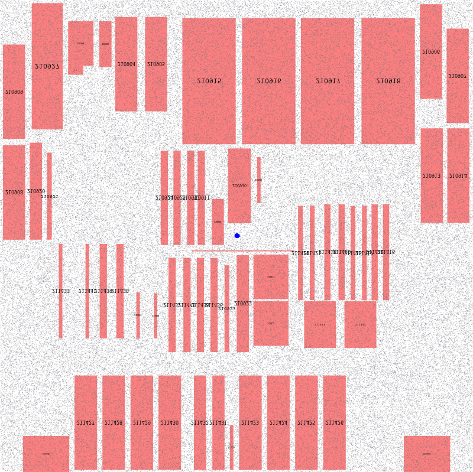
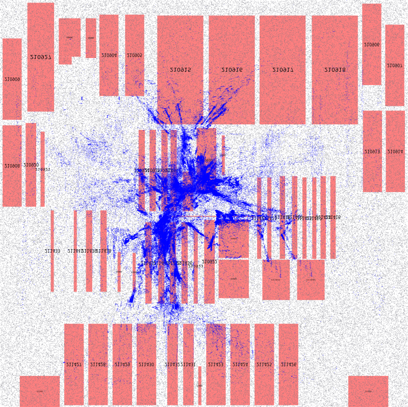
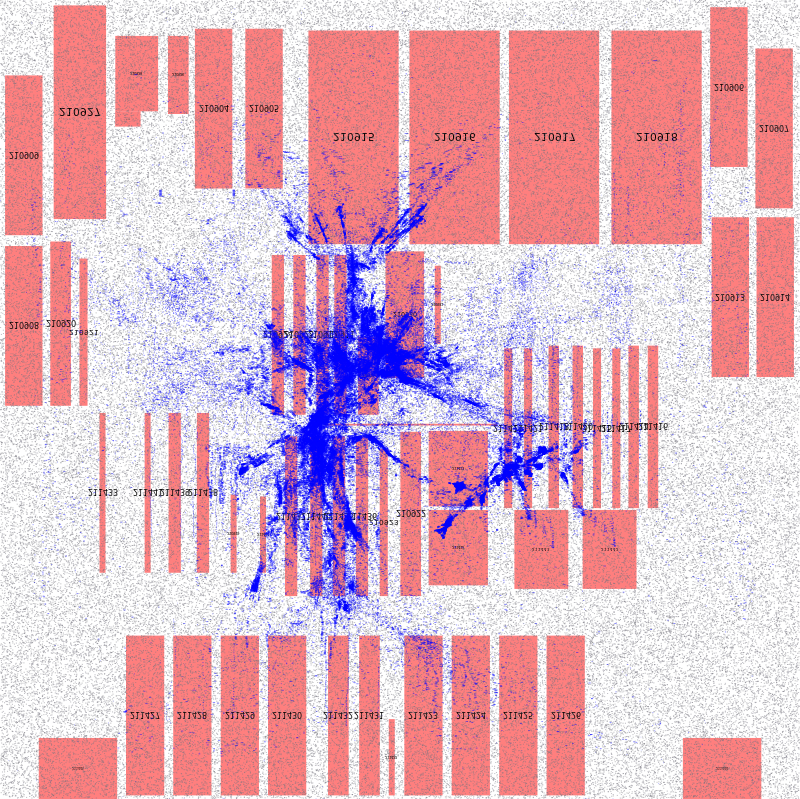
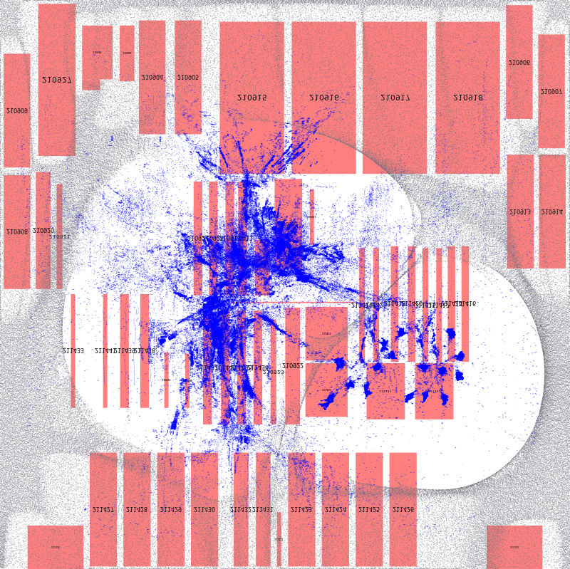
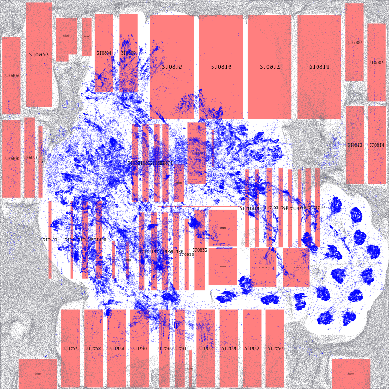
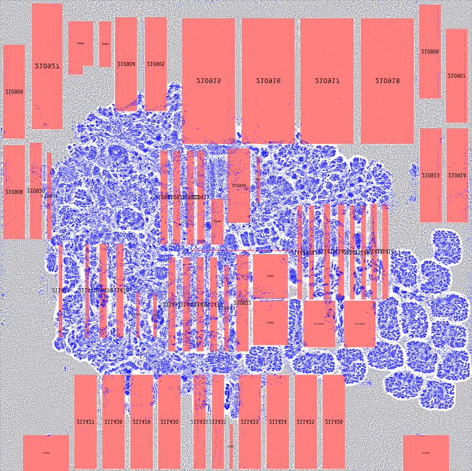
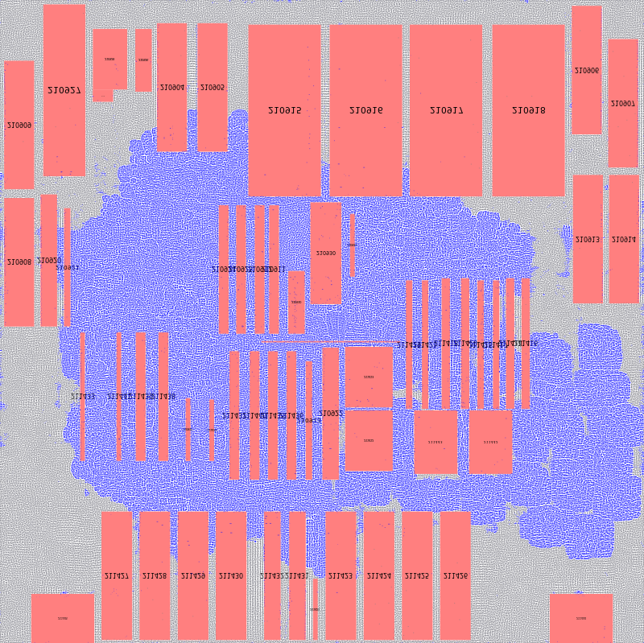
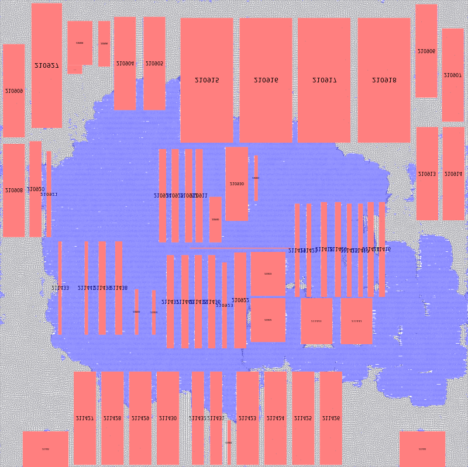

# 🧠 GPU-Accelerated VLSI Placement Tool – Local Setup & Execution Guide (Windows + Docker)

This guide explains how I built, tested, and ran my custom GPU-accelerated VLSI placement engine locally on a Windows system using Docker and NVIDIA GPU support. The project includes step-wise visualization of the placement process across multiple iterations.

---

## 🧰 System Requirements

- **Operating System:** Windows 10/11  
- **GPU:** NVIDIA GPU with Compute Capability ≥ 6.0  
- **Software:**
  - [Docker Desktop](https://www.docker.com/products/docker-desktop) (WSL 2 backend enabled)
  - [NVIDIA GPU Driver](https://www.nvidia.com/Download/index.aspx)
  - [CUDA Toolkit](https://developer.nvidia.com/cuda-downloads)
  - [NVIDIA Container Toolkit](https://docs.nvidia.com/datacenter/cloud-native/container-toolkit/install-guide.html#windows)
  - [Git for Windows](https://git-scm.com/)

---

## ⚙️ Setup and Execution Steps

### 1. Clone the Repository

```bash
git clone --recursive https://github.com/<your-username>/<your-repo>.git
cd <your-repo>
```

---

### 2. Pull or Build Docker Image

```bash
docker pull myvlsi/place:cuda
```

Or build locally:

```bash
docker build . --file Dockerfile --tag myvlsi/place:cuda
```

---

### 3. Run Docker with GPU Support

Replace the path with your local Windows path:

```bash
docker run --gpus all -it -v C:\path\to\project:/project myvlsi/place:cuda bash
```

---

### 4. Build the Tool Inside Docker

```bash
cd /project
mkdir build && cd build
cmake .. -DCMAKE_INSTALL_PREFIX=../install -DPython_EXECUTABLE=$(which python)
make -j$(nproc)
make install
```

---

### 5. Install Python and Cairo Dependencies

```bash
pip install -r /project/requirements.txt
apt-get update && apt-get install -y libcairo2-dev
```

---

### 6. Download Benchmarks

```bash
cd /project
python benchmarks/download_benchmarks.py
```

---

## 🚀 Run a Benchmark with Visualization

### 1. Edit Configuration File

Open and edit `configs/adaptec1.json` to include:

```json
"plot_flag": 1
```

### 2. Execute Placement

```bash
cd /project/install
python placer.py configs/adaptec1.json
```

---

## 📊 Output and Visualization

After execution, the following images are generated and stored in the `results/adaptec1/` folder:

### 📸 Iteration Snapshots

These 8 images represent placement evolution over time:

<p float="left">
  
  
  
  
  
  
  
  
  
  
</p>

You can also convert them into a GIF using:

```bash
convert -delay 100 -loop 0 placement_*.png placement.gif
```

Or use [EZGIF](https://ezgif.com/maker) online.

---

## ✅ Summary

- Successfully built and ran a custom GPU-accelerated VLSI placement tool using Docker and NVIDIA GPU on Windows.
- Benchmarks executed with visual tracking of the placement progression.
- Output included 8 iteration snapshots for detailed visualization.
